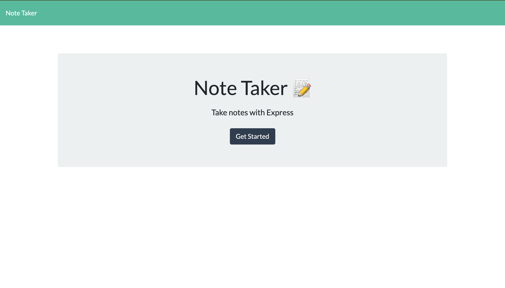
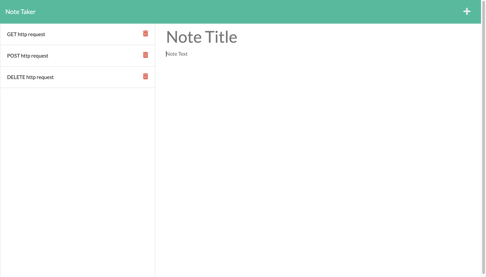

# Module 11 Note Taking App 

## Description

This project involved creating the backend server for an exisiting frontend application.  The app itself lets the user create notes that persist in a psuedo-database.  The frontend app hits the backend with basic http requests.  Concepts applied to this project include:
- Using node.js and the node package manager
- Separating code into different files *(Modular-Routing)* to make the code easier to understand
- Utilizing the file system node package to write and read files
- Correctly routing http requests

## Table of Contents

- [Installation](#installation)
- [Usage](#usage)
- [How to Contribute](#how-to-contribute)
- [Test](#test)
- [Questions](#questions)

## Installation
N/A

## Usage
- Navigate to the url
    - *Click here to navigate to deployed website:* [jstaples50-note-taker](https://jstaples50-note-taker.herokuapp.com/)
- Click 'Get Started' to go to the note taking page
- Type in notes in the text fields, save them, or delete them if desired

## How to Contribute
N/A

## Test
N/A

## Questions
Github: https://www.github.com/jstaples50 
Email: jstaplesmusic@gmail.com

